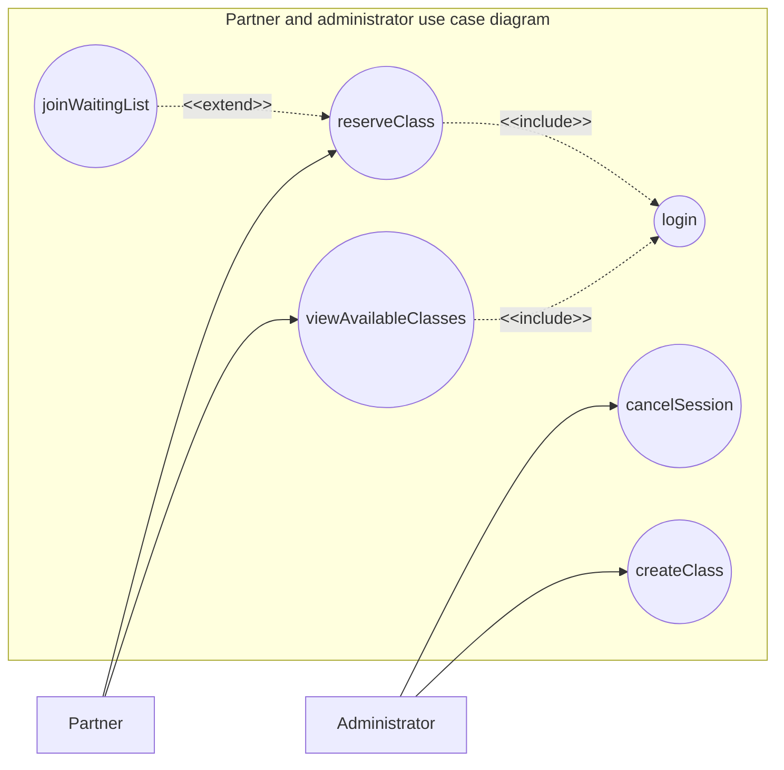

# Entornos7.5

Tarea 1

```mermaid

flowchart LR

Partner[Partner]
Administrator[Administrator]

subgraph Partner and administrator use case diagram

%% Declaración
login((login))
viewClasses((viewAvailableClasses))
reserveClass((reserveClass))
joinWaitingList((joinWaitingList))
createClass((createClass))
cancelSession((cancelSession))

%% Relaciones
viewClasses -.->|&lt;&lt;include&gt;&gt;| login
reserveClass -.->|&lt;&lt;include&gt;&gt;| login
joinWaitingList -.->|&lt;&lt;extend&gt;&gt;| reserveClass

end

%% Enlaces actor-caso de uso
Partner --> viewClasses
Partner --> reserveClass

Administrator --> createClass
Administrator --> cancelSession

```
