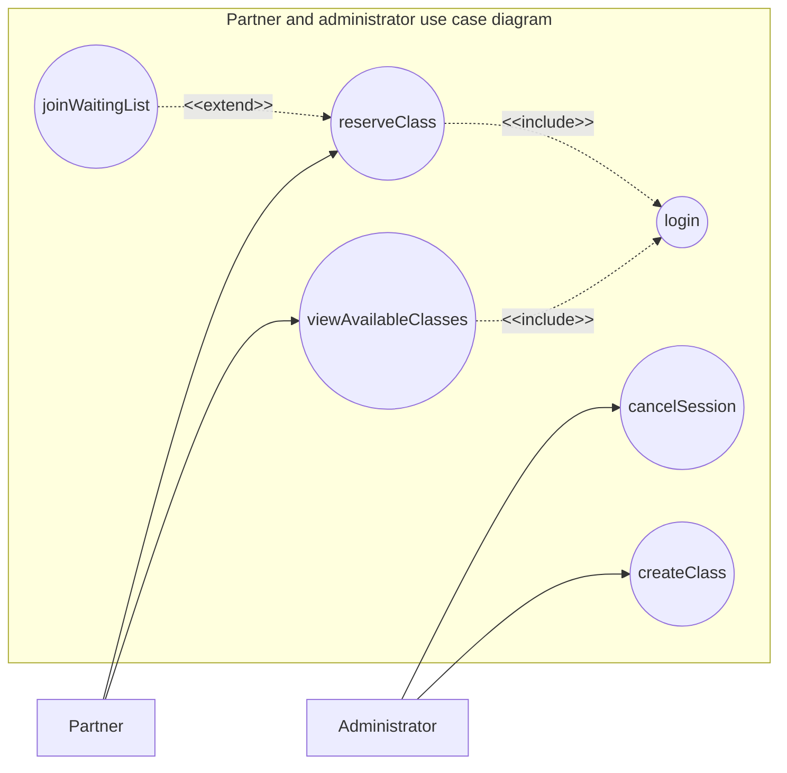
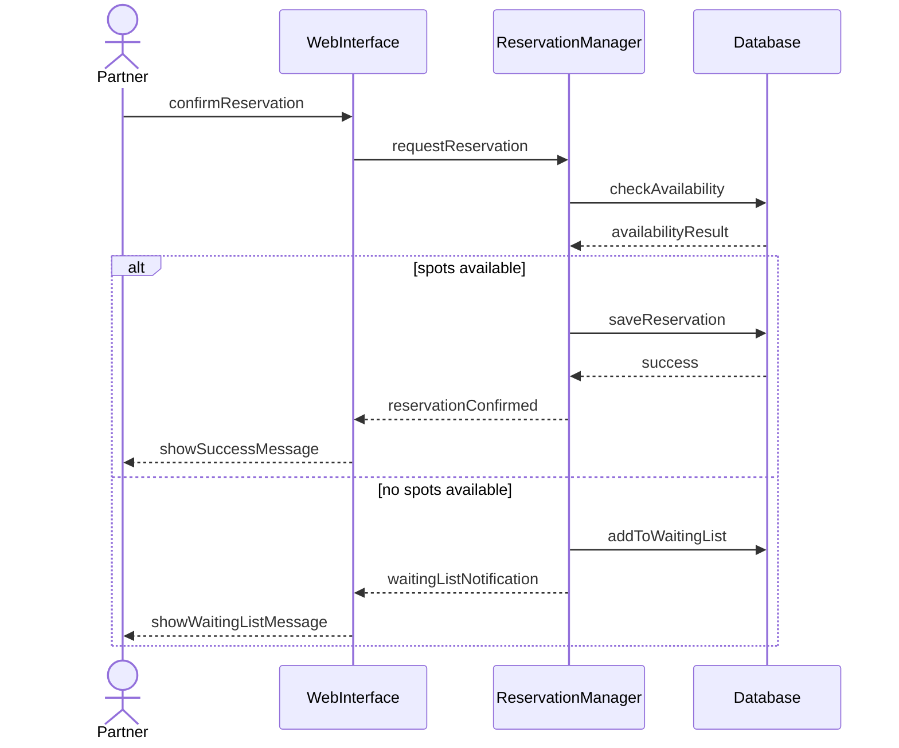
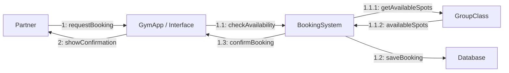

# Entornos7.5

Tarea 1



Tarea 2.



Tarea 3



```mermaid

Tarea 4

flowchart TD

Start((Start))

A[Receive booking request]

B{Membership fee paid?}

C{Spots available?}

D[Block spot]

E[Send confirmation email]

End((End))

Start --> A
A --> B

B -- Yes --> C
B -- No --> End

C -- Yes --> D
C -- No --> End

D --> E
E --> End

```
